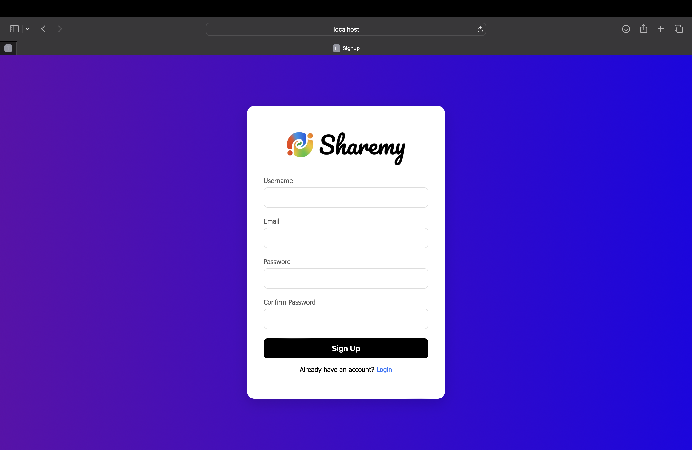

# Sharemy; a file sharing platform 

Sharemy is a **simple, secure, and lightweight file-sharing platform** designed to run on your local network.  
It allows users to **upload, share, and download files seamlessly** using just a browser no external services required.

---

## ✨ Features
- 🔑 **Password-protected uploads** – prevent unauthorized access.  
- 📂 **File uploads & downloads** – easily share files across devices on the same network.  
- 🖱 **Drag-and-drop support** – simple and intuitive interface for quick uploads.  
- ⏳ **Upload progress indicator** – shows loading animation during file uploads.  
- 🎨 **Modern UI** – clean Bootstrap-powered responsive design.  
- ⚡ **Runs locally** – host it on your PC, accessible via Wi-Fi/mobile hotspot.

## Login Page

## Signup Page

## Sharing Platform

